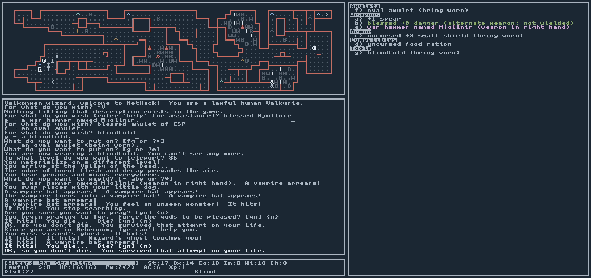

# NetHack 5.0.0 on SDL3 with the curses interface

A light fork of NetHack implementing the [curses interface][] on top of
SDL3 using a [square font][]. The base game is unmodified.

Release builds will run on Windows XP.

## Build

Requires only a C toolchain and CMake, such as [w64devkit][]. Downloads
and compiles dependencies alongside NetHack. The Git submodules are unused
and need not be cloned.

    $ cmake -S sys/sdl3 -B build
    $ cmake --build build

Produces a single executable with assets baked in. In "portable mode"
(`NETHACK_SDL3_PORTABLE`), enabled by default for Windows builds, save
data is written alongside the EXE.

[curses interface]: https://nethackwiki.com/wiki/Curses_interface
[square font]: https://viznut.fi/unscii/
[w64devkit]: https://github.com/skeeto/w64devkit
